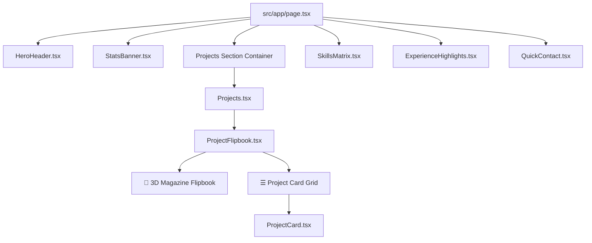
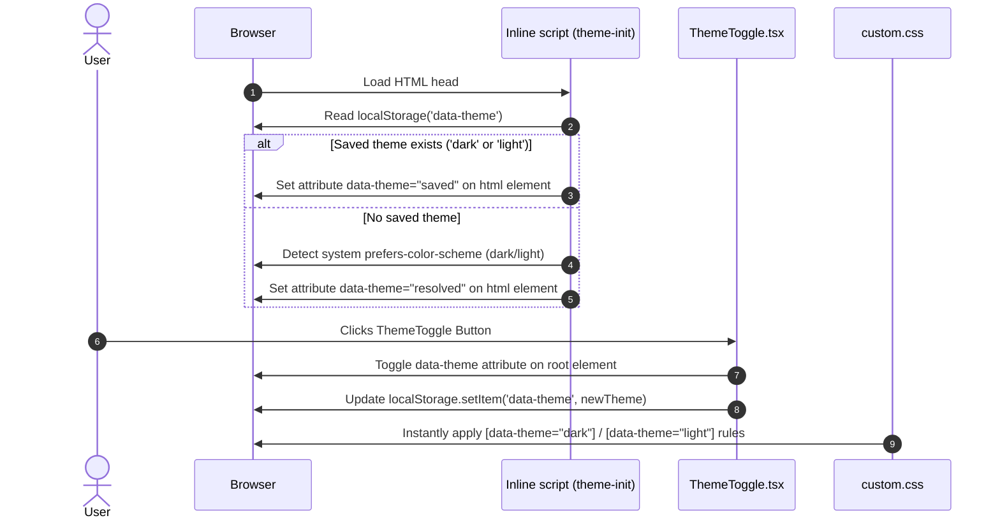

# 🚀 Himanshu Singh Chauhan — Portfolio Architecture & Workflow Documentation

Welcome to the technical workflow documentation for Himanshu Singh Chauhan's Next.js portfolio. This document explains the architecture, directory structure, page flows, component call hierarchy, Dark/Light theme system, 3D Magazine Flipbook, PWA implementation, and SEO engine.

---

## 📂 1. Directory Structure Map

```text
portfolio/
├── public/                      # Static Assets, Icons, Images & Favicons
│   ├── favicon.ico              # Multi-size ICO Favicon for Google Search
│   ├── favicon-32x32.png        # 32x32 PNG Favicon
│   ├── apple-touch-icon.png     # iOS App Touch Icon (180x180)
│   ├── android-chrome-192x192.png # PWA Android App Icon
│   ├── android-chrome-512x512.png # High-res PWA App Icon
│   ├── sw.js                    # PWA Offline Service Worker
│   ├── images/
│   │   ├── himanshu.jpeg        # Main Profile Photo & Avatar
│   │   ├── projects/            # Project Screenshots & Thumbnails
│   │   └── og/                  # OpenGraph Preview Images
│   └── Himanshu-Singh-Chauhan-Resume.pdf # Resume Download Asset
│
├── src/
│   ├── app/                     # Next.js App Router (Pages & Routes)
│   │   ├── layout.tsx           # Root HTML Layout, Providers, Head & SEO Graphs
│   │   ├── page.tsx             # Homepage Route (/)
│   │   ├── manifest.ts          # Native PWA Web App Manifest (/manifest.webmanifest)
│   │   ├── sitemap.ts           # Dynamic XML Sitemap (/sitemap.xml)
│   │   ├── about/
│   │   │   └── page.tsx         # About Me Route (/about)
│   │   └── work/
│   │       ├── page.tsx         # Projects Directory Route (/work)
│   │       └── [slug]/
│   │           └── page.tsx     # Dynamic Case Study Page (/work/[slug])
│   │
│   ├── components/              # Modular UI Components
│   │   ├── Header.tsx           # Sticky Header & Navigation Bar
│   │   ├── Footer.tsx           # Universal Footer
│   │   ├── ThemeToggle.tsx      # Dark / Light Mode Switcher
│   │   ├── Providers.tsx        # Once UI System & PWA Registration Provider
│   │   ├── ProjectCard.tsx      # Split-Screen Project Display Card
│   │   ├── home/                # Homepage Specific Sections
│   │   │   ├── HeroHeader.tsx   # Hero Avatar Badge, Title & CTAs
│   │   │   ├── StatsBanner.tsx  # Key Impact Metrics Banner
│   │   │   ├── SkillsMatrix.tsx # Technical Skills & Architecture Matrix
│   │   │   ├── ExperienceHighlights.tsx # Career Chapters & Work History
│   │   │   └── QuickContact.tsx # Quick Contact CTA Block
│   │   └── work/
│   │       ├── Projects.tsx     # Container rendering Project Flipbook or Cards
│   │       └── ProjectFlipbook.tsx # 3D Magazine Flipbook Showcase
│   │
│   ├── resources/               # Content, Configs & Style Tokens
│   │   ├── content.tsx          # Person Profile, Bio, Work History & Project Data
│   │   ├── once-ui.config.ts    # System Theme, Base URL & Schema Configurations
│   │   ├── custom.css           # Global Theme Styles, Watermark Shadows & Responsive Rules
│   │   └── icons.ts             # Icon Library Registry
│   │
│   └── types/                   # TypeScript Interfaces & Definitions
│
└── WORKFLOW.md                  # Comprehensive Architecture & Workflow Guide
```

---

## 🌐 2. Application Architecture & Main Page Flows

### 🅰️ Root Layout (`src/app/layout.tsx`)
The master wrapper executed on every route. It handles global setup:

1. **Zero-FOUC Theme Script (`theme-init`)**:
   - An inline blocking script injected inside `<head>` reads saved theme settings from `localStorage.getItem('data-theme')` or system preferences before rendering HTML.
   - Immediately sets `data-theme="dark"` or `data-theme="light"` on `document.documentElement` (`root`).
2. **SEO & Social Graph Metadata**:
   - Injects Schema.org `Person`, `ProfilePage`, `WebSite`, and `ItemList` JSON-LD graphs.
   - Links favicon sets (`favicon.ico`, `apple-touch-icon.png`, `manifest.webmanifest`).
   - Sets `robots` and `googlebot` directives (`max-image-preview:large`).
3. **Global UI Layout**:
   - Renders background grid lines and interactive spotlight glow (`<Background />`).
   - Renders the sticky top header (`<Header />`).
   - Wraps children in `<RouteGuard />`.
   - Renders the global footer (`<Footer />`).

---

### 🅱️ Homepage (`src/app/page.tsx`) — Route: `/`
The homepage acts as the primary executive showcase. It composes the following modular components in order:



#### Executed Components Breakdown:
- **`HeroHeader.tsx`**: Renders Himanshu's profile photo (`/images/himanshu.jpeg`) with cyan border glow ring, availability status pill badge, H1 headline, role description, and action buttons (*Explore Featured Work*, *Download Resume*, *Get In Touch*).
- **`StatsBanner.tsx`**: 4 glassmorphic metric cards highlighting 3+ Yrs experience, 3+ apps, 35%+ Lighthouse performance boost, and 1M+ monthly readers.
- **`Projects.tsx`**: Renders the featured work section calling `ProjectFlipbook.tsx`.
- **`SkillsMatrix.tsx`**: Displays 4 technical skill categories (`01 / Core Frontend`, `02 / State & APIs`, `03 / UI Systems`, `04 / Performance & Tools`). Responsive rules stack cards vertically full-width on mobile.
- **`ExperienceHighlights.tsx`**: Highlights Hocalwire Labs experience, LiveLaw platform architecture, and Shopperce AI multi-tenant development.
- **`QuickContact.tsx`**: Glassmorphic CTA card providing email, LinkedIn, and GitHub links.

---

### ℂ About Page (`src/app/about/page.tsx`) — Route: `/about`
Displays full background details, education history, personal projects, and interactive table of contents:

- **`TableOfContents.tsx`**: Fixed left-side navigation links tracking current section scroll position (*Introduction*, *Work Experience*, *Education*, *Projects*).
- **Sticky Avatar Sidebar**: Renders `person.avatar` (`/images/himanshu.jpeg`), phone number, location, and language tags.
- **Work & Education Timelines**: Itemized achievements for Hocalwire Labs, LiveLaw, Shopperce AI, DAV Centenary College, and AD Senior Secondary School.
- **Project Cards**: Displays full-width 16:9 screenshot media wrappers (`<Media aspectRatio="16 / 9" src={image.src} />`) for projects like **Kiska Kitna Hisab**.

---

### 𝔻 Work & Case Study Pages (`src/app/work/` & `src/app/work/[slug]/page.tsx`)
- **`/work` Route**: Dedicated full-page project gallery featuring the interactive 3D Magazine Flipbook and View Mode toggle.
- **`/work/[slug]` Route**: Dynamic MDX case study renderer reading project files from `src/app/work/projects/` (e.g. `kiskakitnahisab.mdx`, `livelaw.mdx`, `shopperce.mdx`, `nextleap.mdx`).

---

## 🌗 3. How Dark / Light Mode System Works

The theme system provides a zero-latency, theme-aware user experience without any screen flickering (FOUC):



### CSS Theme Variable Mappings (`src/resources/custom.css`):
- **Glassmorphic Cards (`.glass-card`)**:
  - **Light Mode (`[data-theme="light"]`)**: Solid white `#ffffff` background with subtle crisp drop-shadow (`box-shadow: 0 10px 30px -5px rgba(0,0,0,0.08)`).
  - **Dark Mode (`[data-theme="dark"]`)**: Translucent navy-dark background (`rgba(15, 23, 42, 0.65)`) with deep ambient drop-shadow (`box-shadow: 0 16px 40px rgba(0,0,0,0.4)`).
- **Background Watermarks (`.watermark-text`)**:
  - **Light Mode**: Translucent slate text (`rgba(15, 23, 42, 0.08)`) with soft ambient drop shadow.
  - **Dark Mode**: Translucent white text (`rgba(255, 255, 255, 0.06)`) with cyan neon glow (`text-shadow: 0 0 30px rgba(6, 182, 212, 0.3)`).
- **Skill Tags (`.skill-tag`) & Badges (`.subtle-badge`)**:
  - Adapt background opacity, border colors, and text contrast automatically based on `[data-theme]`.

---

## 📖 4. 3D Magazine Flipbook Component Architecture

Located in [`src/components/work/ProjectFlipbook.tsx`](file:///Users/satyaprakash/Desktop/portfolio/src/components/work/ProjectFlipbook.tsx):

- **View Mode Switcher**: Allows switching between **📖 Magazine Flipbook** mode and **☰ Grid View** mode.
- **3D Turn Animations**: Utilizes CSS 3D perspective (`perspective: 1600px`) and keyframe animations (`flipNext` / `flipPrev` with `rotateY`) for page turn effects.
- **Responsive Mobile Handling**:
  - On desktop (`min-width: 769px`), displays split 2-page magazine layout (Left: Device Frame & Media, Right: Editorial Spec & Story) with a center gradient seam line (`.page-spine`).
  - On mobile (`max-width: 768px`), pages stack vertically full-width, and `.page-spine` is automatically hidden (`display: none !important`) to eliminate vertical center lines.

---

## 📱 5. Progressive Web App (PWA) System

The website is fully configured as a PWA, enabling offline support and native app installation:

1. **Web App Manifest (`src/app/manifest.ts`)**:
   - Served dynamically at `/manifest.webmanifest`.
   - Defines app `short_name: "Himanshu"`, `theme_color: "#06b6d4"`, `display: "standalone"`, and app icon assets.
2. **Offline Service Worker (`public/sw.js`)**:
   - Caches critical static routes (`/`, `/about`, `/work`), favicons, and `/images/himanshu.jpeg`.
   - Listens to `fetch` events, serving cached assets when offline while fetching updates in the background (*stale-while-revalidate* strategy).
3. **Automated Registration (`src/components/Providers.tsx`)**:
   - Automatically registers `/sw.js` on page load in browser environments.

---

## 🔍 6. Search Engine Optimization (SEO) & Google Indexing Engine

To maximize ranking for **"Himanshu Singh Chauhan"**:

1. **Favicon Infrastructure**:
   - Root `/public` includes `favicon.ico`, `apple-touch-icon.png` (180x180), `favicon-32x32.png`, and `android-chrome-192x192.png`.
   - Explicit `<link rel="icon">` tags in `<head>` prevent Google Search from showing default browser globe icons.
2. **Schema.org JSON-LD Graph**:
   - Connects `Person` schema (`name: "Himanshu Singh Chauhan"`, `image: "/images/himanshu.jpeg"`) with `sameAs` array pointing directly to official **LinkedIn**, **GitHub**, and **Instagram** profiles.
3. **XML Sitemap (`src/app/sitemap.ts`)**:
   - Dynamically outputs `/sitemap.xml` listing static pages, project case studies, `/images/himanshu.jpeg`, and `/favicon.ico` with `priority: 0.9` for fast Googlebot discovery.

---

## 🛠️ Summary Component Call Table

| Route / Context | Main Container | Rendered Sub-Components | Purpose |
| :--- | :--- | :--- | :--- |
| **All Routes** | `src/app/layout.tsx` | `<Header />`, `<Providers />`, `<Footer />`, `<Background />` | Master HTML wrapper, theme script, favicons, SEO graphs |
| **Homepage (`/`)** | `src/app/page.tsx` | `<HeroHeader />`<br>`<StatsBanner />`<br>`<Projects />`<br>`<SkillsMatrix />`<br>`<ExperienceHighlights />`<br>`<QuickContact />` | Main executive portfolio landing page |
| **About (`/about`)** | `src/app/about/page.tsx` | `<TableOfContents />`<br>Sticky Avatar Sidebar<br>Timeline Columns | Detailed background, experience, education, and project screenshots |
| **Work (`/work`)** | `src/app/work/page.tsx` | `<ProjectFlipbook />`<br>`<ProjectCard />` | 3D Magazine Flipbook & Grid view project directory |
| **Case Study (`/work/[slug]`)** | `src/app/work/[slug]/page.tsx` | `<CustomMDX />`<br>`<Media />`<br>`<Projects />` | Dynamic MDX project story renderer |

---

*Documentation maintained for Himanshu Singh Chauhan's Next.js Portfolio Project.*
